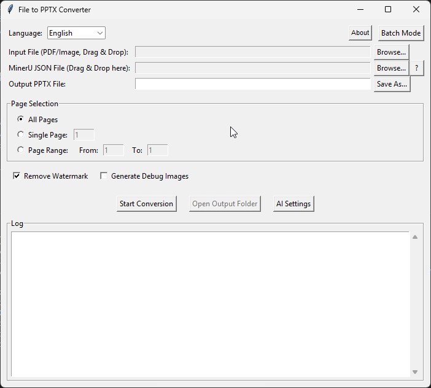
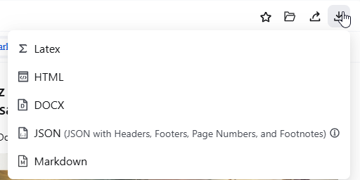

[简体中文](README_zh.md)

[](https://opensource.org/licenses/MIT)
[](https://github.com/arlinamid/MinerU2PPT/releases)
[](https://github.com/arlinamid/MinerU2PPT/releases)
[](https://github.com/arlinamid/MinerU2PPT/stargazers)
[](https://github.com/arlinamid/MinerU2PPT/issues)

# MinerU to PPTX Converter

This tool converts PDF files and images into editable PowerPoint presentations (`.pptx`) by leveraging structured data from the [MinerU PDF Extractor](https://mineru.net/OpenSourceTools/Extractor). It accurately reconstructs text, images, and layout, providing a high-fidelity, editable version of the original document.

> **🙏 Acknowledgment**: This project is inspired by and extends the original [MinerU2PPT by JuniverseCoder](https://github.com/JuniverseCoder/MinerU2PPT). We've added significant enhancements including AI-powered text correction, multi-language support, advanced rendering features, and comprehensive developer tools.

The application features a user-friendly graphical interface (GUI) and is designed for easy use.



## For Users: How to Use

As a user, you only need the standalone executable file (e.g., `MinerU2PPT.exe`). You do not need to install Python or any libraries.

1.  **Download the Application**: Get the latest executable from the project's [Releases page](https://github.com/YOUR_USERNAME/YOUR_REPO/releases).

2.  **Get the MinerU JSON File**:
    -   Go to the [MinerU PDF/Image Extractor](https://mineru.net/OpenSourceTools/Extractor).
    -   Upload your PDF or image file and let it process.
    -   Download the resulting JSON file. This file contains the structural information that our tool needs for the conversion.
    

3.  **Run the Converter**:
    -   Double-click the executable to start the application.
    -   **Select Input File**: Drag and drop your PDF or image file onto the first input field, or use the "Browse..." button.
    -   **Select JSON File**: Drag and drop the JSON file you downloaded from MinerU onto the second input field.
    -   **Output Path**: The output path for your new PowerPoint file will be automatically filled in. You can change it by typing directly or using the "Save As..." button.
    -   **Options**:
        -   **Remove Watermark**: Check this box to automatically erase elements like page numbers or footers.
        -   **Generate Debug Images**: Keep this unchecked unless you are troubleshooting.
    -   Click **Start Conversion**.

4.  **Open Your File**: Once the conversion is complete, click the "Open Output Folder" button to find your new `.pptx` file.

### Using Batch Mode

The application also supports converting multiple files at once in Batch Mode.

1.  **Switch to Batch Mode**: Click the "Batch Mode" button in the top-right corner of the application. The interface will switch to the batch processing view.
2.  **Add Tasks**:
    -   Click the "Add Task" button. A new window will pop up.
    -   In the popup, select the **Input File**, the corresponding **MinerU JSON File**, and specify the **Output Path**.
    -   Set the **Remove Watermark** option for this specific task.
    -   Click "OK" to add the task to the list.
3.  **Manage Tasks**: You can add multiple tasks to the list. If you need to remove a task, select it from the list and click "Delete Task".
4.  **Start Batch Conversion**: Once all your tasks are added, click "Start Batch Conversion". The application will process each task sequentially. A log will show the progress for each file.

## For Developers

This section provides instructions for running the application from source and packaging it for distribution.

### Environment Setup

1.  Clone the repository.
2.  It is recommended to use a virtual environment:
    ```bash
    python -m venv venv
    source venv/bin/activate  # On Windows: venv\Scripts\activate
    ```
3.  Install the required dependencies from `requirements.txt`.
    ```bash
    pip install -r requirements.txt
    ```

### Running from Source

-   **To run the GUI application**:
    ```bash
    python gui.py
    ```
-   **To use the CLI**:
    ```bash
    python main.py --json <path_to_json> --pdf <path_to_pdf> --output <path_to_pptx> [OPTIONS]
    ```

### Packaging as a Standalone Executable (.exe)

You can package the GUI application into a single `.exe` file for easy distribution.

1.  **Install PyInstaller**:
    ```bash
    pip install pyinstaller
    ```

2.  **Build the Executable**:
    Run the `pyinstaller` command from the project's root directory. Use the `--name` flag to specify a professional name for your application.
    -   `--windowed`: Prevents a console window from appearing in the background.
    -   `--onefile`: Bundles everything into a single executable file.
    -   `--name`: Sets the name of the final executable.

    ```bash
    pyinstaller --windowed --onefile --name MinerU2PPT gui.py
    ```

3.  **Find the Executable**:
    Your standalone application, `MinerU2PPT.exe`, will be located in the `dist` folder.

## 📚 Documentation

For comprehensive documentation, please visit the **[docs/](docs/)** folder:

- **[📖 Complete User Guide](docs/USER_GUIDE.html)** - Interactive manual with 3-language support
- **[🏗️ Build Instructions](docs/BUILD_INSTRUCTIONS.md)** - Development setup and deployment
- **[🤖 AI Integration Guide](docs/CLAUDE.md)** - AI services configuration and usage
- **[🌍 Translation System](docs/TRANSLATION_SYSTEM.md)** - Multi-language support details
- **[📋 All Documentation](docs/README.md)** - Complete documentation index

## 📝 Changelog

All notable changes to this project are documented in **[CHANGELOG.md](CHANGELOG.md)**:

- **[v2.0.0 (Latest)](CHANGELOG.md#200---2026-02-10)** - Major release with AI integration, multi-language support, and professional GUI
- **[All Versions](CHANGELOG.md)** - Complete version history and feature additions
- **[Planned Features](CHANGELOG.md#unreleased)** - Upcoming enhancements and roadmap

## 📄 License

This project is licensed under the **MIT License** - see the **[LICENSE](LICENSE)** file for details.

### Attribution
This enhanced version is inspired by and extends [JuniverseCoder's original MinerU2PPT](https://github.com/JuniverseCoder/MinerU2PPT). The significant enhancements (AI integration, multi-language support, professional GUI, comprehensive documentation) are original contributions licensed under MIT.

### Third-Party
This software uses various open-source libraries and AI services. Please see the [LICENSE](LICENSE) file for complete attribution and third-party acknowledgments.

## 💖 Support

If this tool helps you, consider:
- ⭐ **[Star the repository](https://github.com/arlinamid/MinerU2PPT)**
- ☕ **[Buy me a coffee](https://buymeacoffee.com/arlinamid)**
- 🐛 **[Report issues](https://github.com/arlinamid/MinerU2PPT/issues)** for improvements
